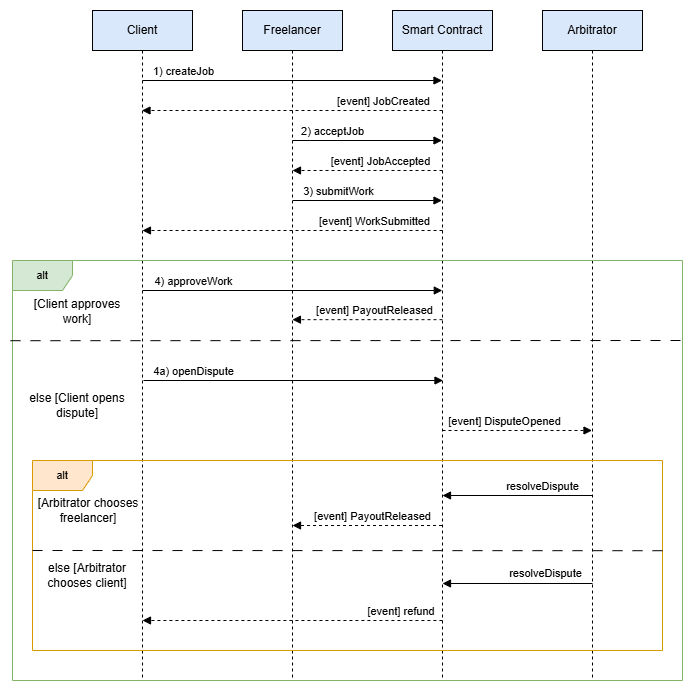
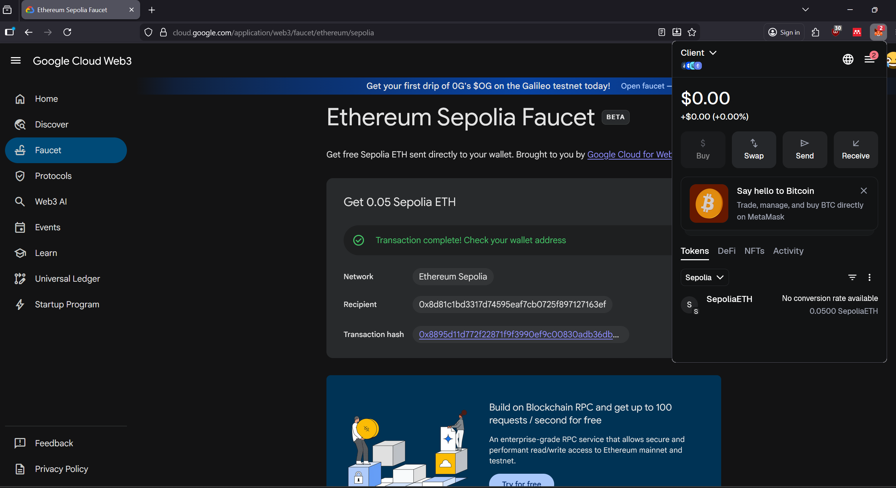
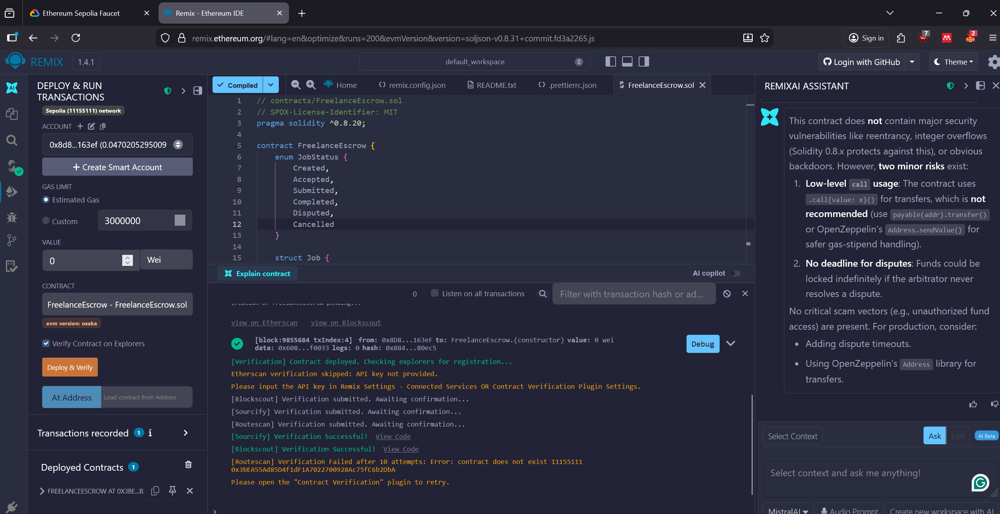
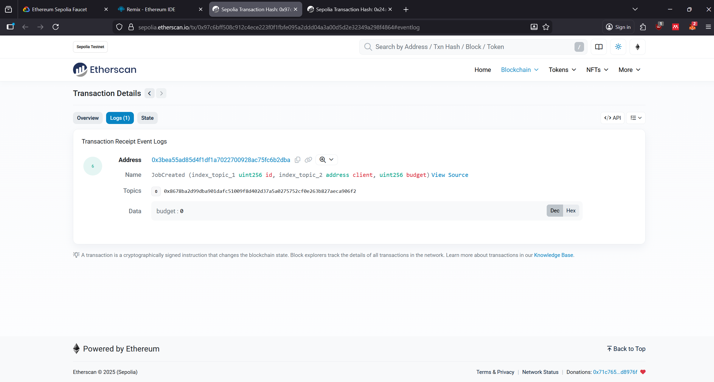
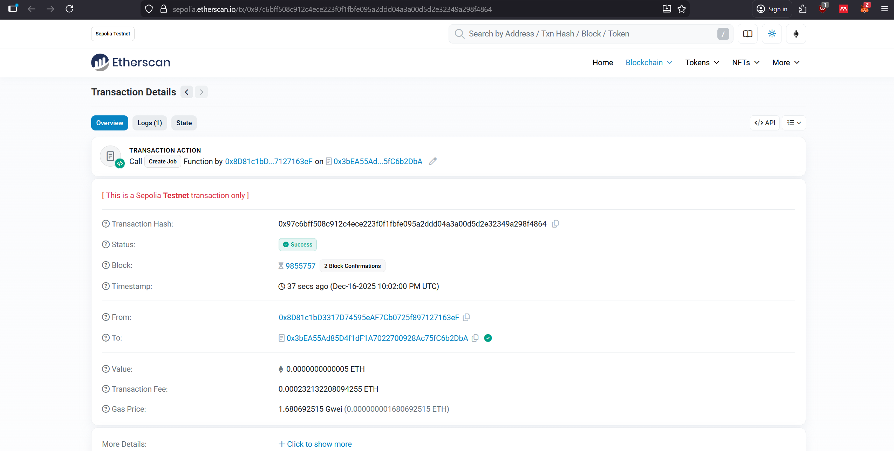
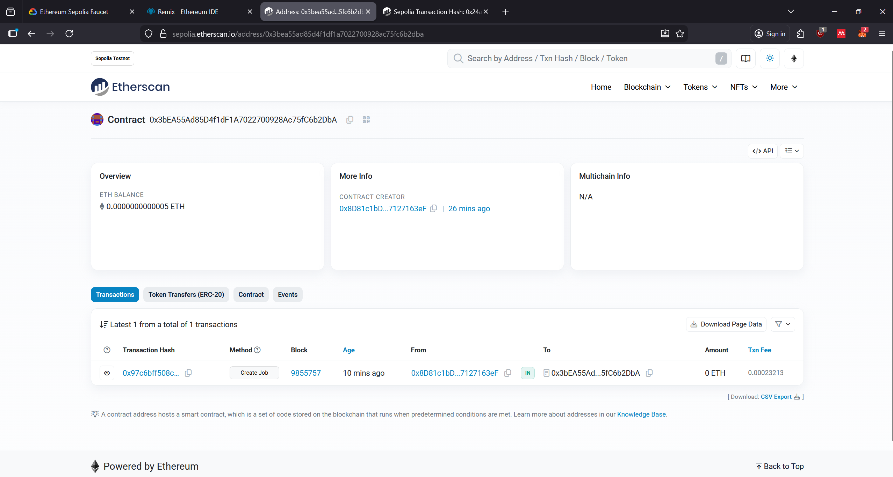

# Povilo Jurgulio Blokų Grandinių Technologijų 4 laboratorinis darbas

# Verslo modelis ir logika:

## Verslo modelio idėja

Šis projektas įgyvendina **freelance eskrovo** (angl. *freelance escrow*) verslo modelį.  
Tikslas – užtikrinti, kad užsakovas (klientas) ir laisvai samdomas darbuotojas (freelanceris) galėtų saugiai atsiskaityti už darbus, o ginčo atveju sprendimą priimtų trečia, neutrali šalis – **arbitras**.

Lėšos už darbą nėra siunčiamos tiesiogiai freelancer‘iui – jos pirmiausia pervedamos į išmaniąją sutartį ir „užšaldomos“ iki tol, kol darbas patvirtinamas arba išsprendžiamas ginčas.

## Pagrindiniai veikėjai

- **Client (užsakovas)**  
  Sukuria darbą, pasirenka freelancerį ir arbitrą, įneša sutartą sumą ETH į eskrovo sutartį ir vėliau patvirtina arba atmeta atliktą darbą.

- **Freelancer (laisvai samdomas darbuotojas)**  
  Priima darbą, jį atlieka ir pateikia rezultatą per išmaniąją sutartį.

- **Arbitrator (arbitras)**  
  Neutrali šalis, įsikišanti tik tada, kai kyla ginčas tarp kliento ir freelancerio. Arbitras nusprendžia, kam turi būti išmokėtos lėšos.

- **FreelanceEscrow išmanioji sutartis**  
  Laiko lėšas, saugo darbų būsenas ir tikrina, kad kiekvieną veiksmą atliktų tik tam skirta šalis (klientas, freelanceris arba arbitras).

## Duomenų modelis

Kiekvienas darbas (job) saugomas struktūroje `Job`:

- `uint256 id` – darbo identifikatorius.
- `address client` – užsakovo adresas.
- `address freelancer` – pasirinkto freelancerio adresas.
- `address arbitrator` – arbitro adresas.
- `uint256 amount` – depozito suma (ETH), kurią klientas įneša į sutartį.
- `JobStatus status` – darbo būsena.
- kiti pagalbiniai laukai (pvz. sukūrimo laikas, aprašymas ir pan., jei naudojama).

Darbo būsena aprašoma išvardijimu (`enum JobStatus`):

1. `Created` – klientas sukūrė darbą ir įnešė depozitą.
2. `Accepted` – freelanceris priėmė darbą.
3. `Submitted` – freelanceris pateikė atliktą darbą.
4. `Completed` – klientas patvirtino darbą, lėšos išmokėtos freelancer‘iui.
5. `Disputed` – klientas atmetė darbą ir iškėlė ginčą.
6. `Cancelled` – darbas atšauktas (pvz., nepriėmus darbo arba iki jo pradžios).

## Pagrindinės funkcijos ir verslo logika

#### 1. Darbo sukūrimas – `createJob`

1. Klientas suformuoja užsakymą: nurodo freelancerio ir arbitro adresus bei sumą **ETH**, kurią įneša į sutartį (`msg.value`).
2. Sutartis sukuria naują `Job` įrašą su būsena `Created`.
3. Sutartis emituoja įvykį `JobCreated`, kuris vėliau matomas „loguose“ (Ganache, Remix, Etherscan).

**Verslo prasmė:** lėšos iš karto atsiduria saugioje vietoje (eskrove), todėl freelanceris mato, kad užsakovas tikrai turi pinigų.

#### 2. Darbo priėmimas – `acceptJob`

1. Funkciją gali kviesti tik tas adresas, kuris nurodytas kaip `freelancer`.
2. Būsena keičiama iš `Created` į `Accepted`.
3. Emisijuojamas įvykis `JobAccepted`.

**Verslo prasmė:** freelanceris oficialiai sutinka atlikti darbą už sutartą sumą.

#### 3. Darbo pateikimas – `submitWork`

1. Funkciją gali kviesti tik freelanceris.
2. Būsena keičiama iš `Accepted` į `Submitted`.
3. Emisijuojamas įvykis `WorkSubmitted`.

**Verslo prasmė:** sutartis fiksuoja, kad freelanceris darbą baigė ir perdavė klientui per sistemą.

#### 4. Darbo patvirtinimas ir apmokėjimas – `approveWork`

1. Funkciją gali kviesti tik klientas.
2. Būsena keičiama į `Completed`.
3. Išmanioji sutartis perveda visą depozito sumą (`amount`) freelancerio adresui.
4. Emisijuojamas įvykis `JobCompleted`.

**Verslo prasmė:** įvyksta saugus atsiskaitymas – pinigai pervedami tik tada, kai klientas patenkintas rezultatu.

#### 5. Ginčas – `openDispute` ir `resolveDispute`

1. Jei klientas nepatenkintas darbu, jis kviečia `openDispute(jobId)`.  
   Būsena keičiama į `Disputed`, emituojamas įvykis `DisputeOpened`.
2. Arbitras peržiūri situaciją „off-chain“ (per el. paštą, dokumentus, kodą ir t. t.).
3. Arbitras kviečia `resolveDispute(jobId, releaseToFreelancer)`:
   - jei `releaseToFreelancer = true`, lėšos išmokamos freelancer‘iui;
   - jei `false`, lėšos grąžinamos klientui.
4. Būsena tampa `Completed`, emituojamas `DisputeResolved`.

**Verslo prasmė:** ginčo sprendimas patikėtas trečiajai šaliai, todėl nei klientas, nei freelanceris negali vienašališkai „pasisavinti“ lėšų.

#### 6. Atšaukimas – `cancelJob`

- Kol darbas dar nepradėtas (pvz., būsena `Created` ir nėra priėmimo), klientas gali atšaukti užsakymą.
- Būsena tampa `Cancelled`, depozitas grąžinamas klientui.

**Verslo prasmė:** apsauga nuo „užstrigusių“ darbų, kai freelanceris nepriima užsakymo.

# Verslo modelio šalių tarpusavio sąveikos sekų diagrama (sequence diagram):

## Toliau aprašomos sekos atitinka sekų diagramą.

### Pagrindinė seka: darbas atliekamas sėkmingai

1) Darbo sukūrimas – `createJob`

- Klientas, prisijungęs per MetaMask, iškviečia createJob funkciją:
nurodo freelancerio adresą; nurodo arbitro adresą; kaip msg.value į escrow įneša darbo biudžetą (ETH).

- Smart Contract:
sukuria naują darbo įrašą (job) su būsena Created; saugo kliento, freelanceriо ir arbitro adresus bei biudžetą; užrakina lėšas kontrakte; emituoja `JobCreated` įvykį, kad būtų galima matyti transakciją Etherscan’e.

2) Darbo priėmimas – `acceptJob`

- Freelanceris, naudodamas savo paskyrą, iškviečia acceptJob nurodydamas darbo ID.

- Smart Contract: patikrina, kad kviečiantis adresas yra būtent nurodytas freelanceris; atnaujina darbo būseną į Accepted; emituoja `JobAccepted` įvykį.

3) Darbo pateikimas – `submitWork`

- Freelanceris, atlikęs darbą, iškviečia submitWork su darbo ID (ir, jei realizuota, su darbo rezultatų nuoroda / detailsHash).

- Smart Contract: pažymi darbą kaip Submitted; emituoja `WorkSubmitted` įvykį.

### Alternatyva A: klientas patenkintas darbu

4) Darbo patvirtinimas – `approveWork`

- Klientas per MetaMask iškviečia approveWork nurodydamas darbo ID.

- Smart Contract: patikrina, kad kviečiantis adresas yra šio darbo klientas; patikrina, kad darbas buvo pateiktas (Submitted); iš escrow perveda visą biudžetą freelancer’iui; atnaujina darbo būseną į Completed; emituoja `PayoutReleased` įvykį (pinigai išmokėti freelancer’iui).

- Šioje šakoje ginčų nėra – kontraktas sėkmingai užbaigia sandorį.

### Alternatyva B: klientas nepatenkintas darbu ir atidaro ginčą

4) a) Ginčo atidarymas – `openDispute`

- Jei klientas nėra patenkintas rezultatu, jis vietoje approveWork iškviečia openDispute su darbo ID.

- Smart Contract: patikrina, kad kviečiantis adresas yra šio darbo klientas; pažymi darbą kaip Disputed; emituoja `DisputeOpened` įvykį.

- Toliau sprendimas perduodamas arbitrui.

### Ginčo sprendimas – `resolveDispute`

- Šiame etape kontraktas turi dvi galimas šakas (alt blokas diagramoje).

#### B1. Arbitratorius palaiko freelanceriо pusę

- Arbitratorius iškviečia resolveDispute nurodydamas darbo ID ir laimėtojo adresą (freelancerį).

- Smart Contract: patikrina, kad kviečiantis adresas yra būtent nurodytas arbitratorius; patikrina, jog darbas yra Disputed būsenos; perveda escrow lėšas freelancer’iui; atnaujina darbo būseną į Completed arba Resolved; emituoja `PayoutReleased` įvykį (pinigai išmokėti freelanceriui pagal arbitro sprendimą).

#### B2. Arbitratorius palaiko kliento pusę

- Alternatyvioje šakoje arbitratorius iškviečia `resolveDispute`, kaip laimėtoją nurodydamas klientą.

- Smart Contract: patikrina arbitrą ir darbo būseną kaip ir ankstesnėje šakoje; grąžina escrow lėšas klientui (refund); atnaujina darbo būseną į Cancelled arba Resolved; emituoja `refund` (arba lygiavertį) įvykį, rodantį, kad lėšos sugrąžintos klientui.

# Saugumo ir teisingumo užtikrinimas:

- Naudojami **modifieriai** (`onlyClient`, `onlyFreelancer`, `onlyArbitrator`, `inStatus`), kurie užtikrina, kad:
  - kiekvieną funkciją gali kviesti tik jam priklausanti šalis,
  - operacijos atliekamos tik teisingoje būsenos sekoje (pvz., negalima patvirtinti darbo, kuris dar nebuvo pateiktas).
- Visi svarbūs veiksmai emituoja **event’us** (`JobCreated`, `JobAccepted`, `WorkSubmitted`, `JobCompleted`, `DisputeOpened`, `DisputeResolved`).

# Verslo modelio santrauka:
- Visi mokėjimai visą laiką laikomi Smart Contract escrow’e – nei klientas, nei freelanceris negali jų vienašališkai pasisavinti.
- Sėkmingo scenarijaus atveju užtenka trijų pagrindinių veiksmų: createJob -> acceptJob -> submitWork -> approveWork.
- Jei kyla ginčas, naudojami papildomi veiksmai: openDispute ir resolveDispute, o galutinį sprendimą dėl biudžeto paskirstymo priima arbitratorius.

# Išmaniosios sutarties veikimas Ethereum testiniame tinkle Sepolia:
- Iš pat pradžių gavau testinių Sepolia ETH, kad galėčiau vykdyti transakcijas:

- "Contract deployed" į Sepolia, naudojant Remix IDE:

 ### Išmaniosios sutarties vykdymo log'ai (ir overview) per Etherscan

- Žemiau pateikiamas
`JobCreated` įvykio (event) log'as iš Etherscan:

- Transaction overview (Create Job):

- Sutarties adresas Etherscan’e:
